Backend Vaudoise - Insurance Client & Contract Management API

A RESTful API built with Spring Boot for managing insurance clients and their contracts.

📋 Table of Contents

Prerequisites
Quick Start
API Endpoints
Testing with Postman
Architecture & Design
Proof of Functionality
Technology Stack

🔧 Prerequisites
Before you begin, ensure you have the following installed:

☕ Java 17 or higher
📦 Maven 3.6+
🐳 Docker Desktop (for PostgreSQL 17)
🔧 Git

🚀 Quick Start
Step 1: Clone the Repository
Open Git Bash (or terminal) and run:
git clone https://github.com/Zouaghi-Ghaith/vaudoise-insurance-api.git
cd vaudoise-insurance-api

Step 2: Start PostgreSQL with Docker
First Time Setup
Create and run PostgreSQL container:

docker run --name postgres-vaudoise \
-e POSTGRES_USER=Vaudoise \
-e POSTGRES_PASSWORD=Vaudoise \
-e POSTGRES_DB=postgres \
-p 5432:5432 \
-d postgres:17

Verify the container is running:
docker ps

You should see postgres-vaudoise in the list.
For Subsequent Uses
Start the existing container:
docker start postgres-vaudoise

Stop the container when done:
docker stop postgres-vaudoise

💡 Alternative: If you don't want to use Docker, you can install PostgreSQL directly on your PC and create a database named postgres.

Step 3: Build and Run the Project

Open the project in your IDE (IntelliJ IDEA, Eclipse, VS Code, etc.)
Build the project:
mvn clean install

Run the application:
mvn spring-boot:run

The API will start on http://localhost:8080 ✅

📋 API Endpoints

Client Management
Method                    Endpoint                                            Description
------                    -------------------------------------------         ------------------------------------------------------
POST                      /api/clients                                        Create a new client (PERSON or COMPANY)
GET                       /api/clients/{id}                                   Get client details by ID
PUT                       /api/clients/{id}                                   Update client (name, phone, email only)
DELETE                    /api/clients/{id}                                   Delete client and close all contracts

Contract Management
Contract Management
*******************
Method                    Endpoint                                            Description
------                    -------------------------------------------         ------------------------------------------------------
POST                      /api/clients/{clientId}/contracts                   Create a contract for a client
GET                       /api/clients/{clientId}/contracts                   Get active contracts (optional: ?updatedSince=ISO8601)
GET                       /api/clients/{clientId}/contracts/sum-active        Get sum of all active contract costs
PUT                       /api/contracts/{id}                                 Update contract details

🧪 Testing with Postman

you can test all endpoints with samples using postman (exemple in Proof of Functionality)

🏗️ Architecture & Design
Layered Architecture: The application follows a classic 3-tier architecture with Controllers (REST API), Services (business logic), and Repositories (data access), ensuring clear separation of concerns and maintainability.
DTOs for API Contract: Data Transfer Objects decouple the API layer from internal entities, preventing over-exposure of internal structure and enabling independent evolution of API and database schemas.
Validation Strategy: Jakarta Bean Validation annotations on DTOs ensure data integrity at the API boundary. Cross-field validations (e.g., date ranges) use @AssertTrue methods for complex business rules.
Soft Delete Pattern: Client deletion sets contract endDate to current date rather than hard deleting, preserving historical data for audit and compliance requirements.
Performance Optimization: Database-level aggregation (SUM query) for active contracts sum avoids loading unnecessary data. Composite indexes on client_id + end_date optimize active contract lookups.
Audit Trail: Internal updateDate timestamp tracks modifications without API exposure, supporting synchronization scenarios via the updatedSince filter parameter.

✅ Proof of Functionality

1. Create company:
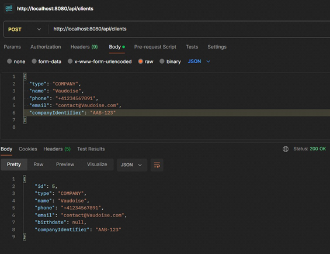

Constraints :
All not null
Email:
Unique company identifier
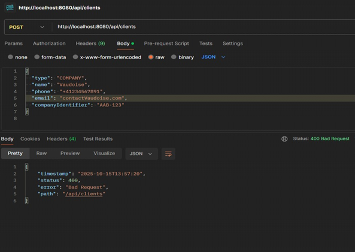
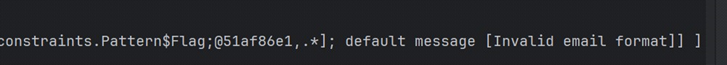

Phone number shouldn't be:
less than 7 char
have characters
more than 25
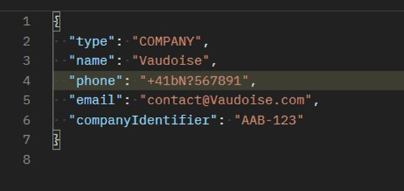
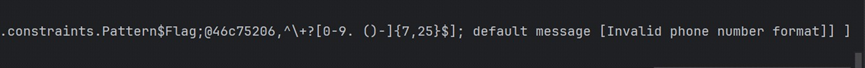

2. Create Person:
All Dates ISO 8601 format.
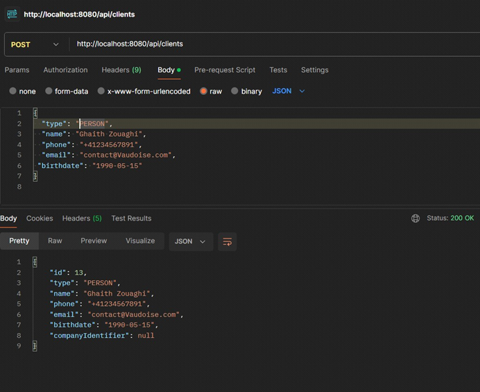

Contraints:
Same for company plus:
Birthdate dates
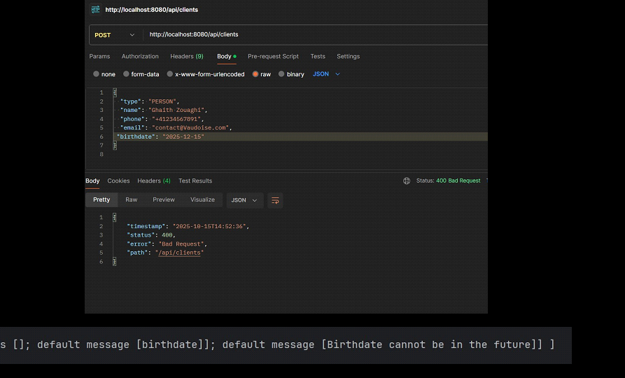

3. Read a person/company
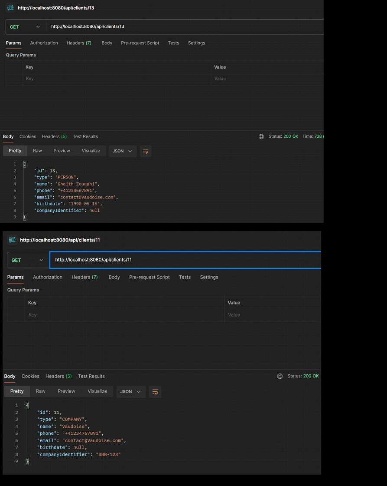

4. Update client: except birthdate and company identifier
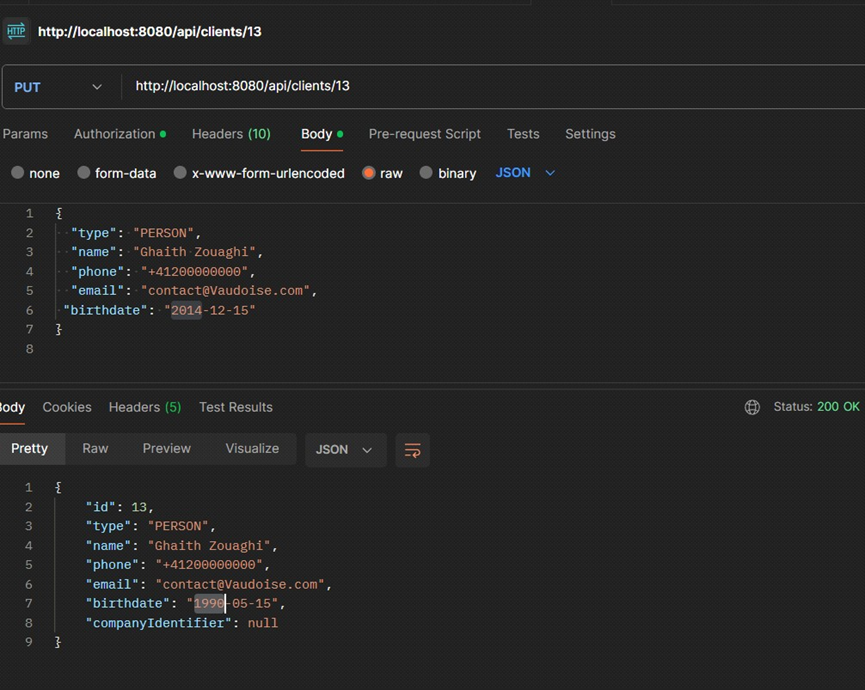

5. Delete client:
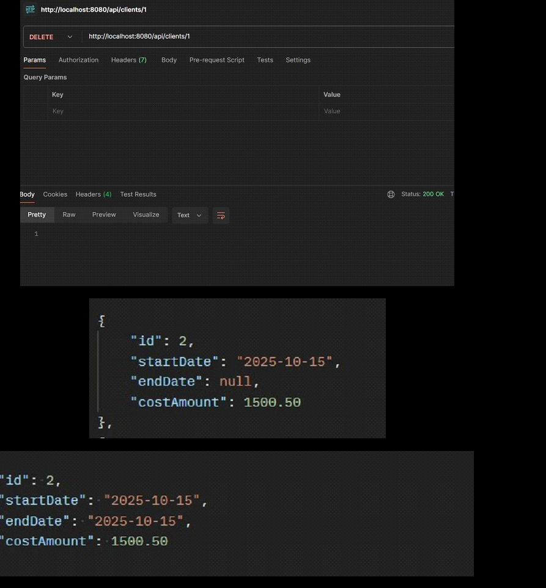

6. create contract
create conract for a client
* contact has a start date (if not provided, set it to the urrent date) an end date (if not provided then put null value)
* contract cost amount
* keep the update date (last modified date) internally, it should not be exposed in the api
* 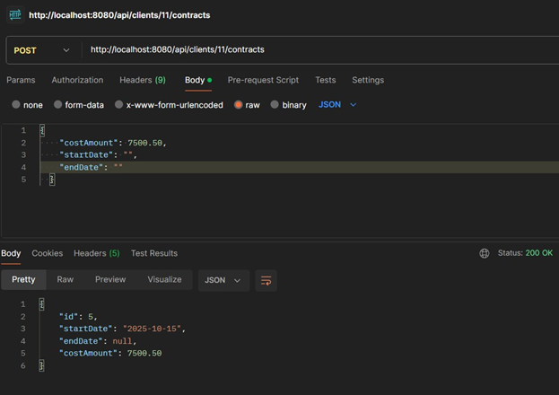
* 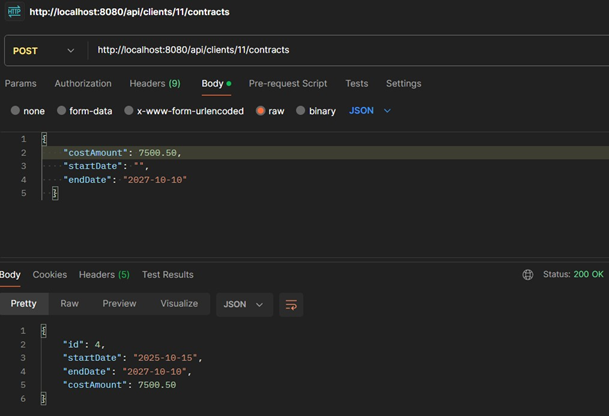

costAmount should be positive
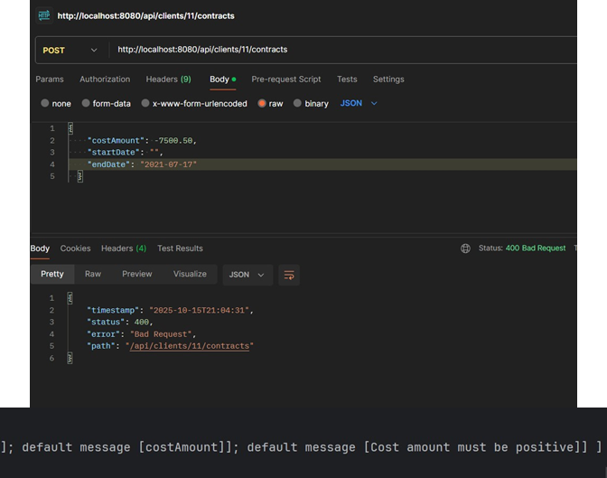

7. Update the CostAmount
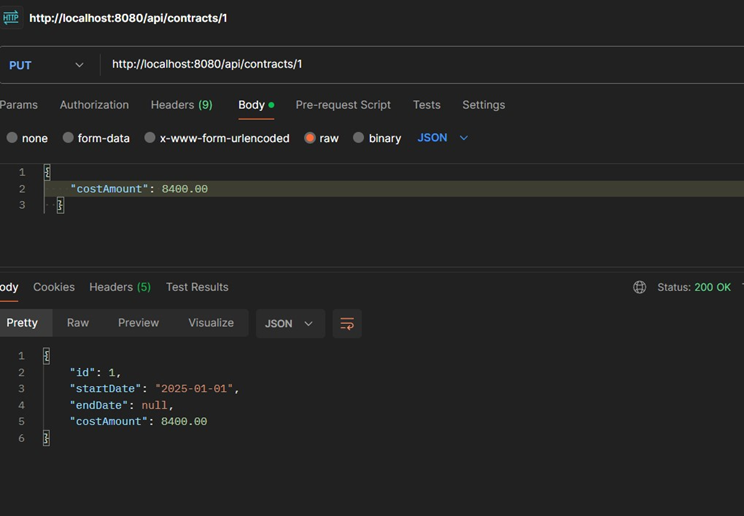

8. Get Active Contracts
   Returns Only Active Contracts (current date < end date):

Supports filtering by updatedSince parameter
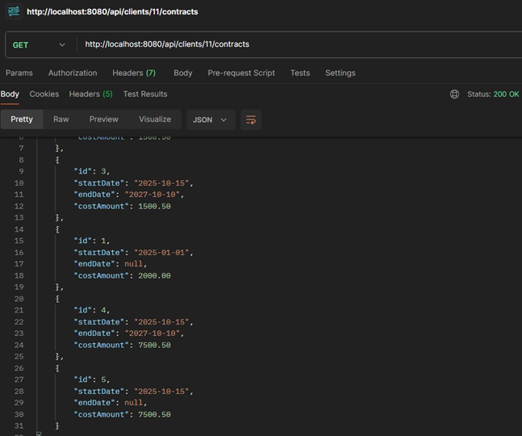

9. Sum of Active Contracts
A very performant endpoint that returns the sum of all the cost amount of the active
contracts (current date < end date) for one client.
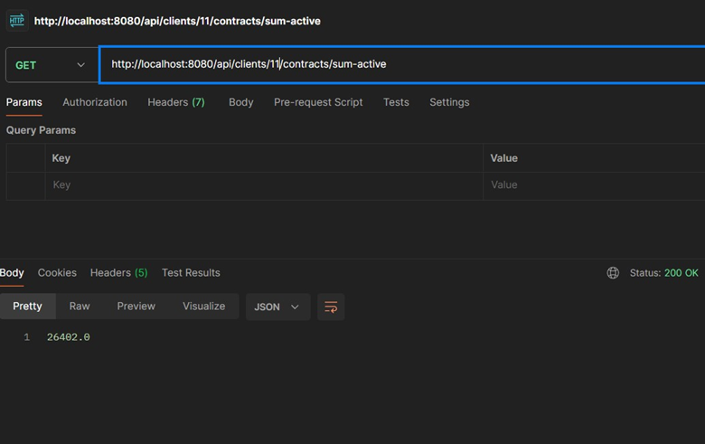

🛠️ Technology Stack

Framework: Spring Boot 3.x
Language: Java 17
Database: PostgreSQL 17
ORM: Spring Data JPA / Hibernate
Validation: Jakarta Bean Validation
Build Tool: Maven
Containerization: Docker

📦 Project Structure
src/main/java/com/vaudoise/backend_vaudoise/
├── Controllers/       # REST API endpoints
├── Services/          # Business logic layer
├── Repositories/      # Data access layer (JPA)
├── Entities/          # Database entity models
├── Dtos/              # Data Transfer Objects
└── BackendVaudoiseApplication.java

📝 Business Rules

✅ Active Contracts: endDate is NULL OR endDate > current date
✅ Client Deletion: Sets all contract endDate to current date (soft delete)
✅ Immutable Fields: Birthdate and company identifier cannot be updated
✅ Auto Timestamps: Contract updateDate automatically updated on modifications
✅ Default Values: Start date defaults to current date if not provided
✅ ISO 8601 Format: All dates follow YYYY-MM-DD format
